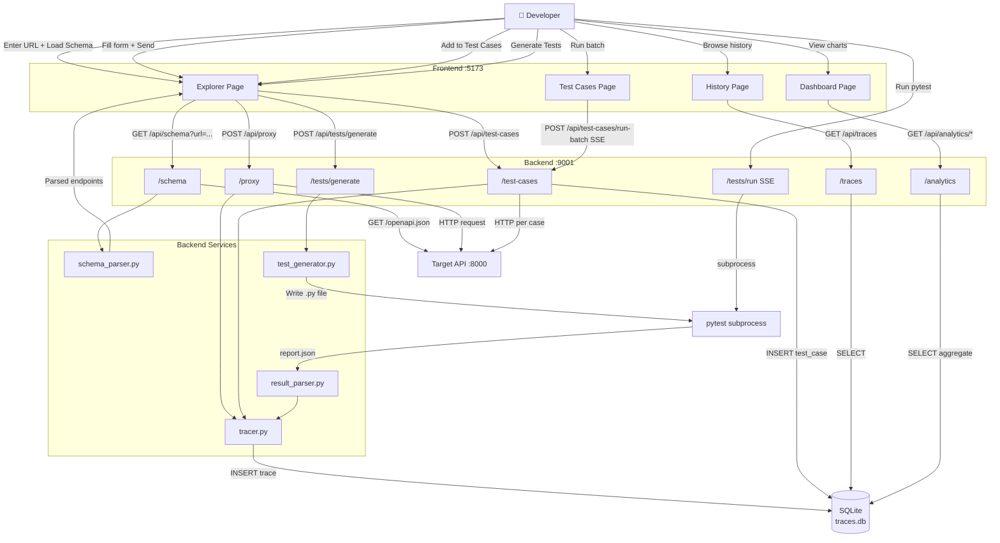
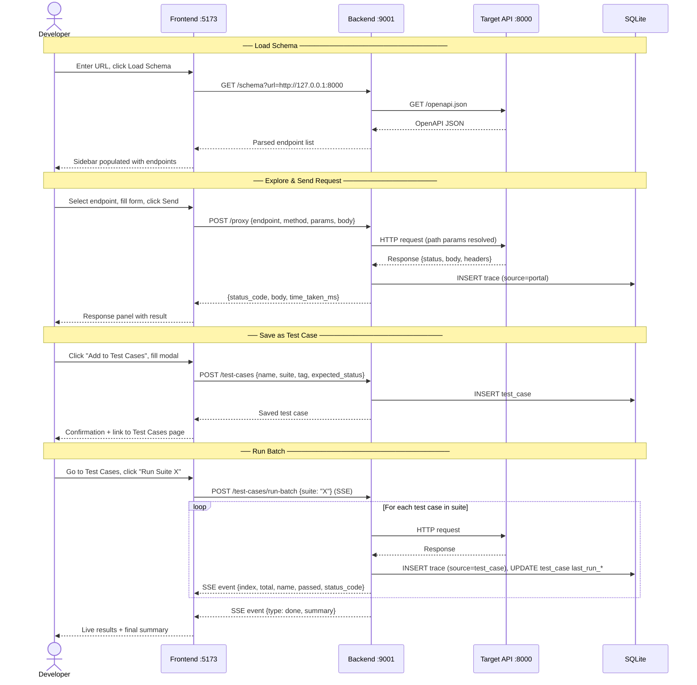
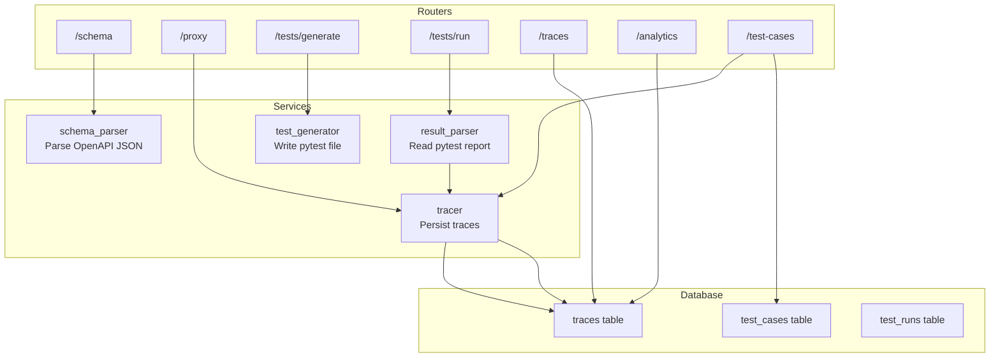
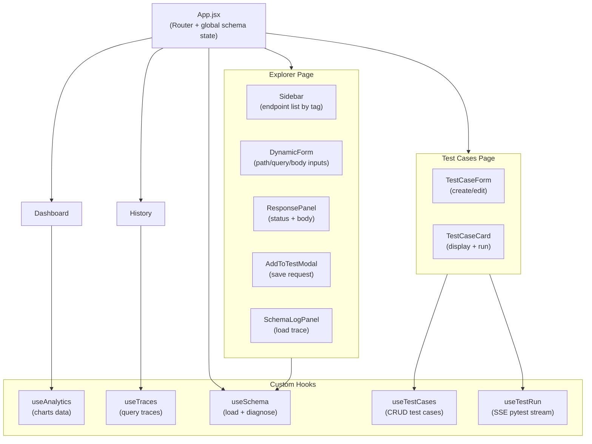
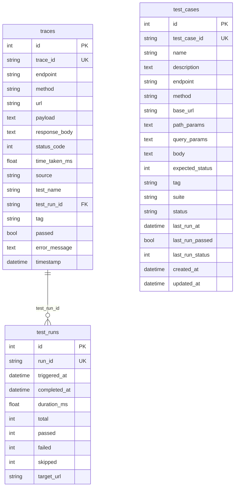
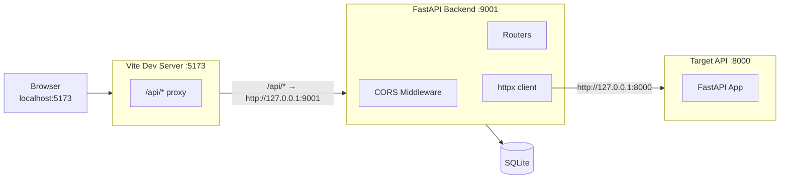

# Architecture — API Dev Dashboard

---

## 1. System Overview

The dashboard is a three-process local application:

```
┌─────────────────────────────────────────────────────┐
│                  Developer's Machine                │
│                                                     │
│  ┌──────────────┐    ┌──────────────┐    ┌────────┐ │
│  │  Frontend    │    │  Backend     │    │ Target │ │
│  │  React/Vite  │◄──►│  FastAPI     │◄──►│  API   │ │
│  │  :5173       │    │  :9001       │    │  :8000 │ │
│  └──────────────┘    └──────┬───────┘    └────────┘ │
│                             │                       │
│                      ┌──────▼───────┐               │
│                      │   SQLite     │               │
│                      │   traces.db  │               │
│                      └──────────────┘               │
└─────────────────────────────────────────────────────┘
```

| Process | Technology | Port | Role |
|---|---|---|---|
| Frontend | React 18 + Vite + Tailwind | 5173 | UI, state management |
| Backend | FastAPI + SQLAlchemy | 9001 | API proxy, data persistence, analytics |
| Sample API | FastAPI | 8000 | Example target API for testing |

The frontend never calls the target API directly. All requests are proxied through the backend, which records every call as a trace.

---

## 2. Application Workflow



---

## 3. User Workflow



---

## 4. Backend Architecture



### Router responsibilities

| Router | File | Responsibility |
|---|---|---|
| `schema` | `routers/schema.py` | Fetch + parse OpenAPI from target URL |
| `proxy` | `routers/proxy.py` | Forward requests to target; record traces |
| `generator` | `routers/generator.py` | Generate pytest file from schema |
| `runner` | `routers/runner.py` | Run pytest; stream logs via SSE |
| `traces` | `routers/traces.py` | CRUD + filter on trace records |
| `analytics` | `routers/analytics.py` | Aggregate queries on traces table |
| `test_cases` | `routers/test_cases.py` | CRUD + single/batch execution of test cases |

---

## 5. Frontend Architecture



### State management strategy

| State | Location | Why |
|---|---|---|
| Loaded schema | `App.jsx` via `useSchema` | Survives page navigation — one load serves all pages |
| Selected endpoint | `Explorer.jsx` local | Only relevant within Explorer |
| Traces query results | `useTraces` hook | Refetched on filter change |
| Test cases | `useTestCases` hook | Refetched after mutations |
| Analytics | `useAnalytics` hook | Fetched once on Dashboard mount |
| Batch run stream | `useTestRun` hook | SSE lifecycle tied to run button |

---

## 6. Database Schema



---

## 7. Network Flow & Port Map



> **Windows note:** On Windows, `localhost` resolves to `::1` (IPv6) before `127.0.0.1` (IPv4). The backend automatically replaces `localhost` with `127.0.0.1` when fetching target APIs to avoid a ~2 second DNS penalty when the target is IPv4-only. Start all uvicorn processes with `--host 127.0.0.1` to ensure consistent IPv4 binding.

---

## 8. SSE Streaming Architecture

Two features use Server-Sent Events to stream results in real time:

### Pytest runner (`POST /tests/run`)

```
Client (EventSource)          Backend
      │                           │
      │── POST /tests/run ───────►│
      │                           │ spawn pytest subprocess
      │◄── data: {type:log} ──────│ stream stdout line-by-line
      │◄── data: {type:log} ──────│
      │      ...                  │ pytest completes
      │◄── data: {type:result} ───│ parse report.json
      │◄── data: {type:done} ─────│
      │                           │
```

### Batch test case runner (`POST /test-cases/run-batch`)

```
Client (fetch + ReadableStream)  Backend
      │                              │
      │── POST /run-batch ──────────►│
      │                              │ filter test cases
      │◄── data: {type:start} ───────│
      │◄── data: {type:result, i=1} ─│ run case 1 via httpx
      │◄── data: {type:result, i=2} ─│ run case 2
      │      ...                     │
      │◄── data: {type:done} ────────│ all cases complete
```

---

## 9. Key Design Decisions

| Decision | Rationale |
|---|---|
| **SQLite default** | Zero setup — works out of the box. Swap to PostgreSQL via `DATABASE_URL` for teams. |
| **httpx over requests** | Async-native; works seamlessly in FastAPI async routes |
| **Vite proxy for /api** | Browser → backend calls go through Vite proxy, avoiding CORS and making the base URL configurable in one place (`vite.config.js`) |
| **Schema state in App.jsx** | Prevents schema loss when navigating between pages — one load, available everywhere |
| **SSE for streaming** | Simpler than WebSockets for unidirectional server→client streams; works with native browser `EventSource` |
| **Source field on traces** | Distinguishes portal (manual), pytest (automated), and test_case (saved) — critical for analytics segmentation |
| **`localhost` → `127.0.0.1` fix** | Windows DNS dual-stack behavior causes a 2s penalty; hardcoding IPv4 eliminates it |
| **Port 9001 not 9000** | Port 9000 is used by Zscaler (corporate VPN) on Cognizant machines — confirmed via `netstat` |
